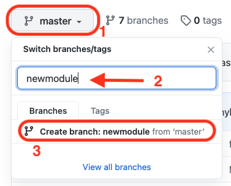

# Tutorial: Create a DSL2 Module

In this tutorial we will see how to create a new module for the nf-core modules repository. As an example, we will create a module to execute the FastqToBam function of the FGBIO suite of tools.

## Table of Contents

- [Introduction](#introduction)
    - [Module guidelines](#module-guidelines)
    - [NF-core Tools](#nf-core-tools)
- [Fork repository](#fork-the-modules-repo-and-branch)
- [Create template](#create-the-module-template)
- [Write the Code](#write-the-code)
    - [Inputs and Outputs](#inputs-outputs)
    - [Options args](#passing-options.args)
    -[Lint code](#lint-your-code)
- [Test code](#test-your-code)
    -[Create YAML](#create-test-yaml)
    -[Run tests](#run-tests-locally)
- [Pull Request](#create-a-pull-request)

## Introduction

### module guidelines

[nf-core guidelines](https://github.com/nf-core/modules#guidelines)

### nf-core tools

Using [nf-core tools](https://nf-co.re/tools) is the best way to follow the guidelines without worrying too much and writing things from scratch.
On the website you can find more details about [installation](https://nf-co.re/tools#installation), and all functionalities for [modules](https://nf-co.re/tools#modules).

## Fork the Modules Repo and branch

## Create the module template

## Write the code

### Inputs/Outputs

### Passing options.args 

### Lint your code

## Test your code

### Create test YAML

### Run tests locally

## Create a Pull Request

